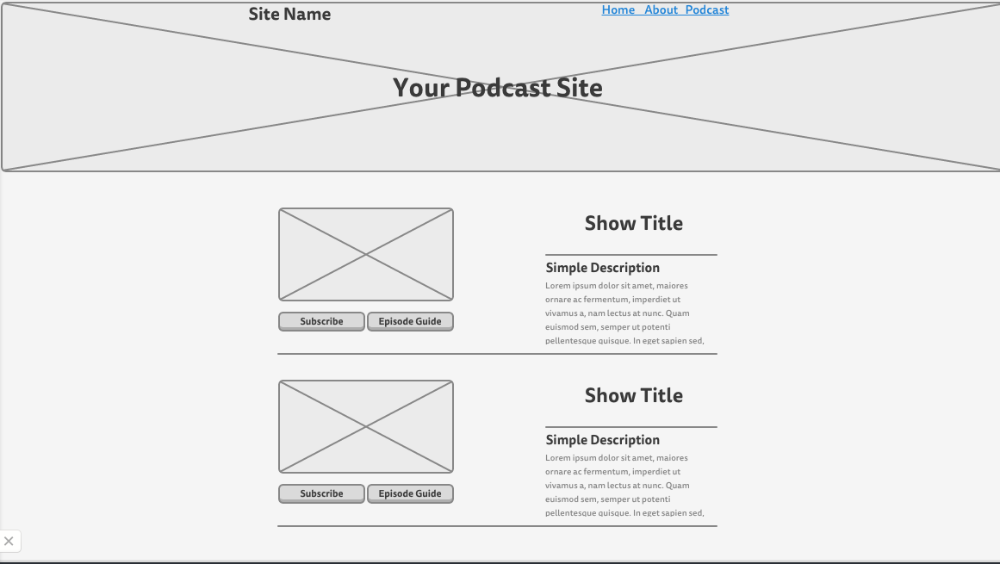

#Podcast.tv

##Challenge

Podcasts can be a huge wealth of information, especially for the up & coming programmer. Host's typically provide programming on the latest and greatest technology, practice and news in their particular field of interest. Your mission, should you choose to accept, will be to create a static webpage with links to your favorite podcast (Or blog if you haven't any podcasts). Utilize the wireframe to guide your design.

Be sure that your project meets all of the success criteria.

###Success Project will..
- Utilize valid Semantic Markup.
- Provide functional link to subscription page.
- Provide functional link to episode guide.
- Will utilize valid CSS (*NOTE*: You can style the page with any color scheme you'd like as long as it confirms to the structure provided in the mock up).
- Be launched onto Firebase and shared with other students.
